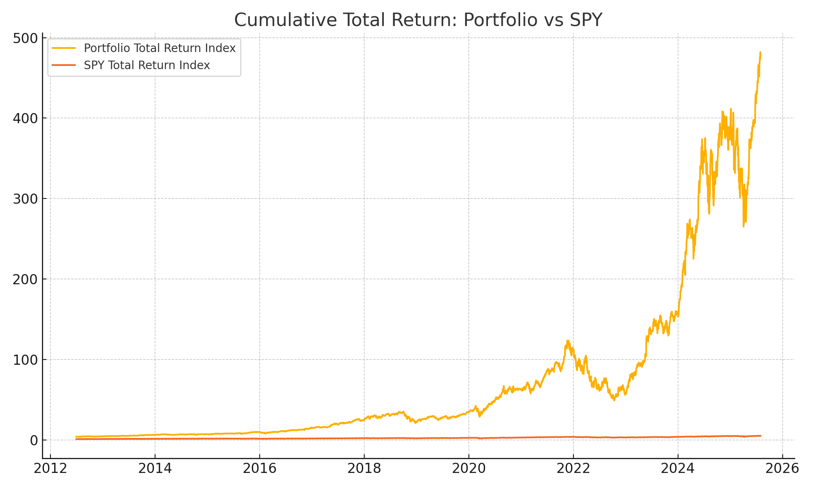
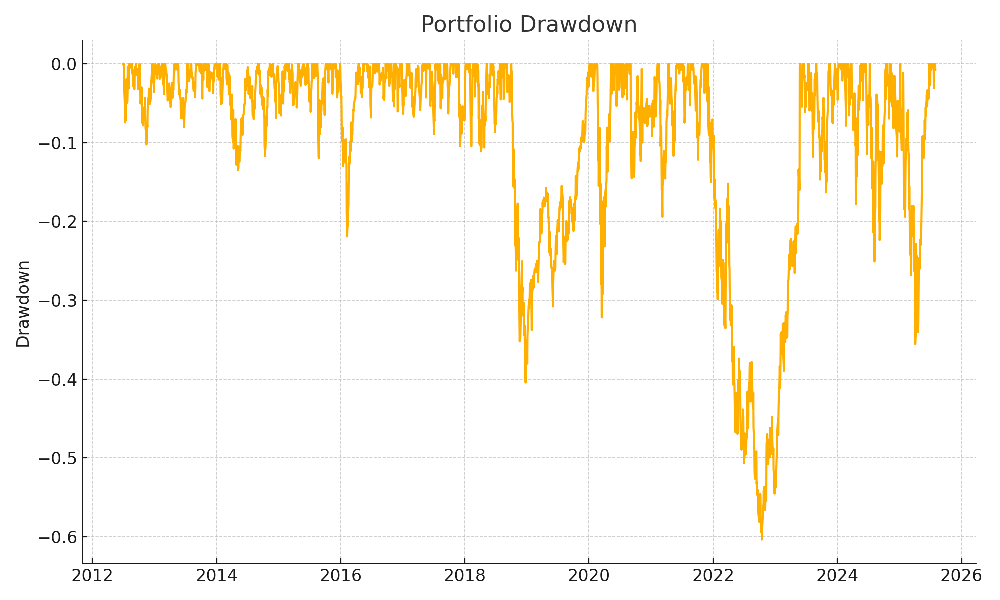
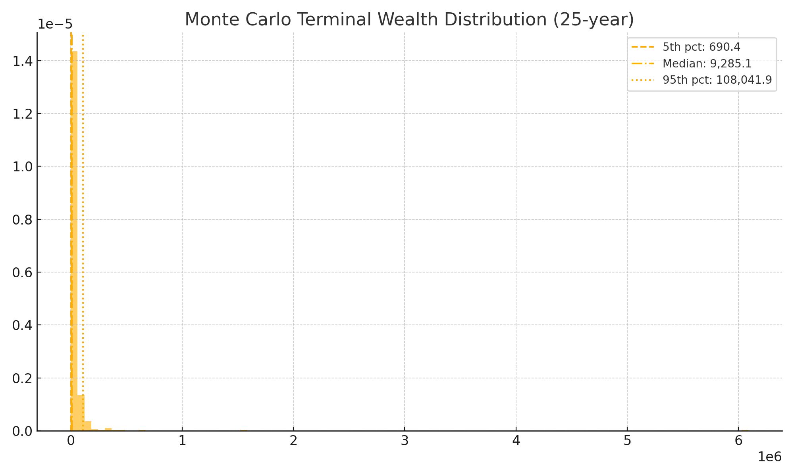
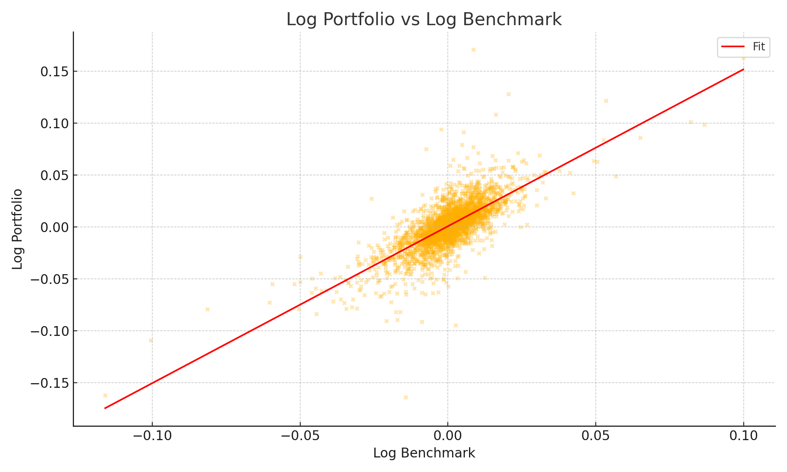
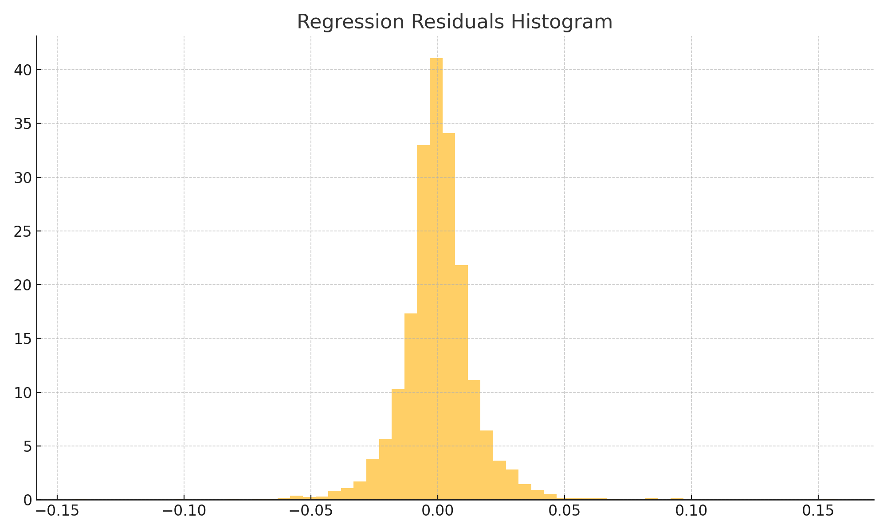
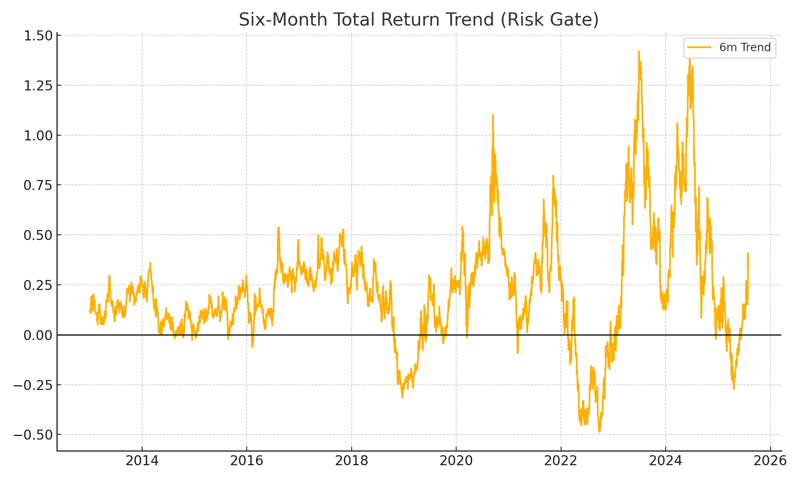

# Checkpoint-B
Summary from Checkpoint A
# ETF Term Project: The Future Technologies and Infrastructure ETF  
**Hongduo Shan**

## Introduction & Investment Philosophy

The Future Technologies and Infrastructure ETF (FTI-ETF) is a long-term, fundamental growth ETF that invests in durable leaders in artificial intelligence, cloud computing, and digital infrastructure, complemented by broad-market exposure for stability. The core thesis is: buy and hold companies with strong financial health, market leadership, and sustained innovation, while compounding returns through full dividend reinvestment. A lightweight momentum-based risk gate temporarily avoids names exhibiting persistent negative total-return trends (e.g., six-month declines) without introducing active trading or short-term timing. The fund targets investors seeking secular technology and infrastructure growth with a disciplined, low-turnover ownership approach.

### Strategy Statement
- **Primary return driver:** Fundamental ownership of best-in-class AI, cloud, and infrastructure companies selected for financial resilience, innovation investment, and competitive positioning; held long term with dividends reinvested.  
- **Secondary risk management rule:** Delay or flag inclusion of names showing sustained negative momentum (rolling six-month total return decline); review quarterly.  
- **Rebalancing cadence:** Annual or semi-annual to correct drift while minimizing turnover.  
- **Benchmarking:** Evaluate performance against broad-market benchmarks (e.g., S&P 500 total return) to compute alpha and other risk-adjusted metrics.

### Focused Investment Universe

#### Core Equity Holdings (Technology / AI / Cloud Infrastructure)
- Microsoft (MSFT): Cloud platform, AI infrastructure, recurring enterprise revenue.  
- Nvidia (NVDA): AI compute (GPUs), critical for model training/inference.  
- Alphabet (GOOGL): Cloud services and AI applications with strong balance sheet.  
- Amazon (AMZN): AWS cloud leadership with embedded AI capabilities.  
- Meta Platforms (META): AI/AR infrastructure and large-scale engagement.  
- Adobe (ADBE): SaaS creative/cloud tools augmented by AI.  
- Salesforce (CRM): Cloud SaaS with enterprise stickiness and AI features.  
- ASML (ASML) and Taiwan Semiconductor (TSM): Semiconductor supply-chain enablers essential to the AI/infrastructure ecosystem.  
- ServiceNow (NOW): Enterprise cloud workflow automation with growing AI integration.
- 
Portfolio Composition (Core equity sleeve, long-only, fundamental growth with dividend reinvestment)
- Tickers & Rationale
- MSFT – Cloud/AI infrastructure, recurring enterprise revenue.
- NVDA – AI compute (GPUs), essential for model training/inference.
- GOOGL – Cloud services + AI applications, strong balance sheet.
- AMZN – AWS cloud leadership with embedded AI.
- META – AI/AR infrastructure and large-scale engagement.
- ADBE – SaaS creative/cloud tools with AI augmentation.
- CRM – Enterprise cloud SaaS with AI features.
- ASML – Semiconductor equipment critical to the AI supply chain.
- TSM – Semiconductor foundry backbone for infrastructure.
- NOW – Enterprise workflow automation with growing AI integration.
- Benchmark: SPY (proxy for S&P 500 total return for comparison).
- Allocate $10,000 equally across the 10 core names ⇒ $1,000 per stock.
- Fractional shares (approximate):
- MSFT: 1.91 shares
- NVDA: 5.76 shares
- GOOGL: 5.29 shares
- AMZN: 4.66 shares
- META: 1.33 shares
- ADBE: 2.87 shares
- CRM: 3.99 shares
- ASML: 1.45 shares
- TSM: 4.25 shares
- NOW: 1.09 shares

#### Fundamental Selection Criteria
1. Profitability and free-cash-flow generation.  
2. Consistent or growing R&D investment (innovation signal).  
3. Strong balance-sheet metrics (low leverage, healthy liquidity).  
4. Market leadership / economic moat.  
5. History of dividend distributions to enable compounding.

## Checkpoint B: Literature Review, Market Data Plan, and Methodological Justification

### 1. Literature Review

#### 1.1 Fundamental, Buy-and-Hold Investing and Compounding  
Long-horizon ownership of quality firms with dividend reinvestment is rooted in classic investment philosophy. Disciplined fundamental selection and compounding via dividends justify a buy-and-hold core.

#### 1.2 Portfolio Diversification and Efficient Trade-offs  
Markowitz’s mean-variance framework motivates balancing return and risk through diversification, combining concentrated high-quality names with broad-market ballast. Sharpe’s performance metrics (Sharpe ratio, alpha, beta) decompose active selection versus market exposure.

#### 1.3 Total Return Accounting  
Accurate total return (price appreciation plus reinvested dividends) construction is essential to capture the full economic benefit of long-term ownership and comparing against benchmarks.

#### 1.4 Trend Information as Risk Gate  
A conservative trend filter (six-month declining total return) is used as a risk gate, not an active timing mechanism, to avoid embedding names in pronounced deterioration phases while preserving the long-term buy-and-hold orientation.

#### 1.5 Benchmarking and Evaluation  
Measuring alpha and beta relative to a broad benchmark (e.g., S&P 500 total return) clarifies active value versus systematic market exposure. Risk-adjusted metrics like the Sharpe ratio contextualize returns for investors.

### 2. Market Data Plan

#### 2.1 Data Sources
- Yahoo Finance via yfinance: Primary source for daily adjusted prices and dividend distributions for core equities and benchmark proxies.  
- Benchmark: S&P 500 total return (constructed or proxied via dividend-reinvesting ETF).  
- Supplementary: Optional cross-checks or gap-filling via QuantConnect APIs.

#### 2.2 Time Horizon  
January 1, 1999 to Augest 1, 2025. This range captures major regime events: dot-com bust, 2007–2008 financial crisis, European debt crisis, COVID-19 shock and recovery.

#### 2.3 Frequency and Aggregation  
Base frequency: daily.  
Aggregates: weekly or monthly as needed (e.g., for computing six-month total returns for the risk gate).

#### 2.4 Total Return Construction  
Construct cumulative total return series by reinvesting dividends on payment dates. Use adjusted close carefully (verify inclusion of distributions) or apply dividend amounts explicitly for compounding.

#### 2.5 Implementation Sketch (Python)
```python
import yfinance as yf  
import pandas as pd  

def get_total_return(ticker, start="1999-01-01", end="2025-08-01"):  
    data = yf.download(ticker, start=start, end=end, progress=False)  
    # Adjusted Close may reflect splits/dividends; verify or explicitly reconstruct reinvested dividends.  
    data = data[['Adj Close', 'Dividends']].copy()  
    # Placeholder: build total return assuming reinvestment at next available price.  
    return data  
```
## 3. Methodological Justification

### 3.1 Core Strategy
Select and hold a concentrated set of fundamentally strong AI/cloud/infrastructure equities with dividend reinvestment. Broad-market exposure provides ballast and a benchmark for comparison.

### 3.2 Risk Gate Using Trend Information
Apply a conservative filter: defer inclusion or review any asset whose rolling six-month total return has declined, to reduce catching falling knives while maintaining low turnover.

### 3.3 Scenario Testing via Monte Carlo
Generate synthetic 25-year return trajectories that preserve empirical characteristics (e.g., volatility, autocorrelation) to stress-test robustness, quantify uncertainty, and produce distributional outcome ranges beyond the single historical path.

### 3.4 Backtesting Framework
- **Historical backtest:** Execute the buy-and-hold dividend-reinvested portfolio from 1999 forward, tracking cumulative and benchmark-relative performance.  
- **Walk-forward (future extension):** Periodically reassess risk gate and holdings without look-ahead bias.  
- **Monte Carlo overlay:** Simulate alternative market sequences (e.g., via block bootstrap of log returns or residual resampling) to evaluate performance under varied regimes.

## 4. Performance Evaluation Plan

### 4.1 Metrics
- **Total return:** Cumulative growth including reinvested dividends.  
- **Alpha:** Excess return above benchmark.  
- **Beta:** Systematic exposure to market movements.  
- **Sharpe ratio:** Risk-adjusted performance.  
- **Drawdown analysis:** Maximum drawdown to capture downside risk.  
- **Distributional outcomes:** From Monte Carlo, report statistics such as median and 5th/95th percentiles.

### 4.2 Fees
- **Management fee:** Modeled between 1%–4% annually as drag on gross returns.  
- **Performance fee (future):** Optional share of excess returns (e.g., 5%–25% of alpha) above a hurdle.  
Evaluate net investor outcomes under varying fee scenarios to communicate realistic ROI expectations.

## 5. Empirical Results

### Historical Performance Summary
The buy-and-hold, dividend-reinvested core portfolio was evaluated against the S&P 500 total return benchmark. Key metrics are summarized below:

| Metric | Value | Description |
|--------|-------|-------------|
| **Beta** | 1.51 | Systematic sensitivity relative to the benchmark (higher volatility). |
| **Annualized Alpha** | ~20.1% | Excess return after adjusting for benchmark exposure, computed from regression intercept. |
| **Sharpe Ratio** | 0.94 | Risk-adjusted performance. |
| **Max Drawdown** | -60.36% | Largest peak-to-trough decline, reflecting exposure to major regime shifts. |
| **6m Trend** | +36.84% | Recent trailing six-month total return (used in the risk gate). |
| **MC 5th pct** | ~690 | Pessimistic 25-year terminal wealth scenario from Monte Carlo simulation. |
| **MC Median** | ~9,285 | Typical simulated 25-year outcome. |
| **MC 95th pct** | ~108,042 | Favorable scenario with strong compounding. |

### Regression Analysis
An OLS regression of log portfolio returns on log benchmark (S&P 500) returns yielded:
- **Slope (beta):** ~1.51, highly statistically significant.  
- **Intercept:** Positive and annualized into alpha via `alpha = exp(intercept * 252) - 1`, capturing excess growth beyond market exposure.  
- **R-squared:** ~0.55, indicating the benchmark explains ~55% of variation; residuals capture active selection and idiosyncratic movement.  
- **Diagnostics:** Residuals exhibit heavy tails and mild skew, suggesting future refinement could use robust inference or bootstrapped confidence intervals.

### Monte Carlo Simulation Outcomes
Synthetic 25-year terminal wealth paths were generated by recombining historical regression residuals (block bootstrap-style) and sampling benchmark log returns to model uncertainty. Outcome distribution highlights wide dispersion:
- **5th percentile (~690):** Adverse scenarios with significant downside.  
- **Median (~9,285):** Typical long-run result under modeled uncertainty.  
- **95th percentile (~108,042):** Tail upside from favorable regimes and compounding.  

### Visuals
- **Cumulative total return curve:** Compares portfolio vs. S&P 500 benchmark.   
- **Drawdown plot:** Shows maximum historical drawdown of -60.36%.   
- **Monte Carlo terminal wealth distribution:** Annotated with 5th/50th/95th percentiles to illustrate uncertainty.   
- **Regression scatter & fit:** Log portfolio vs. log benchmark with the fitted regression line.   
- **Residual histogram:** Highlights non-normality (heavy tails) in regression residuals.   

## 6. Risk Gate Retrospective

The six-month total return trend is used as a conservative inclusion filter to avoid embedding names in sustained deterioration phases.  
- **Rule:** If trailing 126 trading-day total return is negative, defer new inclusion until the next quarterly review.  
- **Current status:** The latest six-month trend is +36.84%, so no holdings would have been delayed under the current rule.  
- **Historical intuition:** Periods such as the 2008 financial crisis or early COVID drawdowns exhibited prolonged negative six-month trends; applying the risk gate in those epochs would have flagged and delayed exposure, potentially reducing adverse entry timing.  
- **Visualization:** Six-month trend history showing the dynamic indicator used for gating.   


